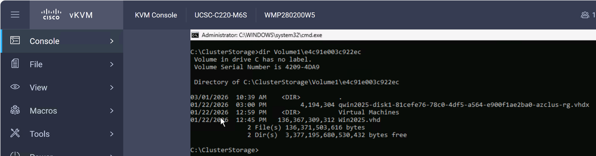
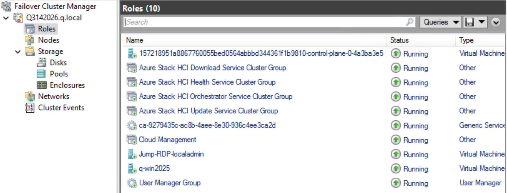
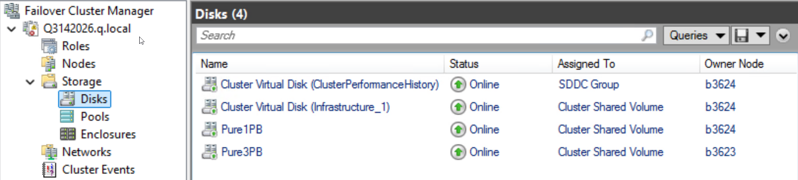
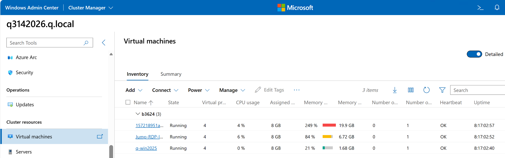
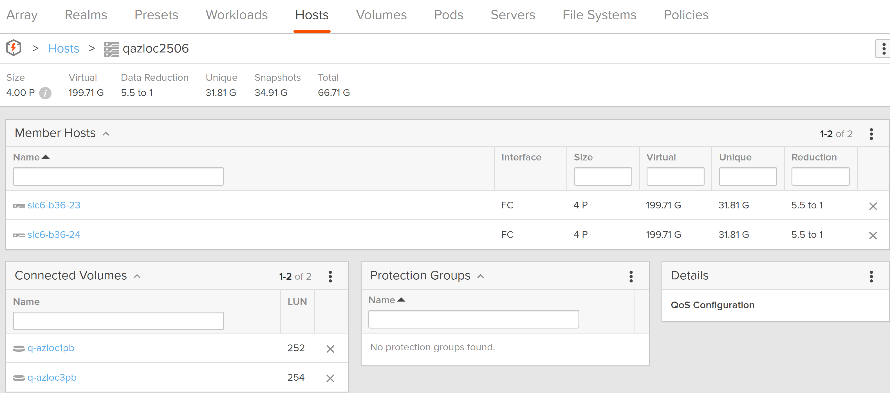
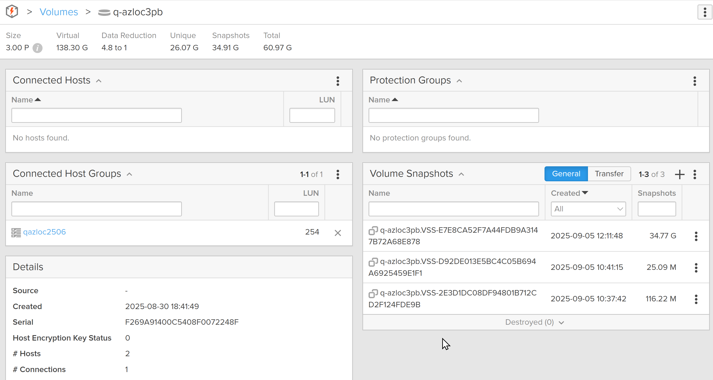
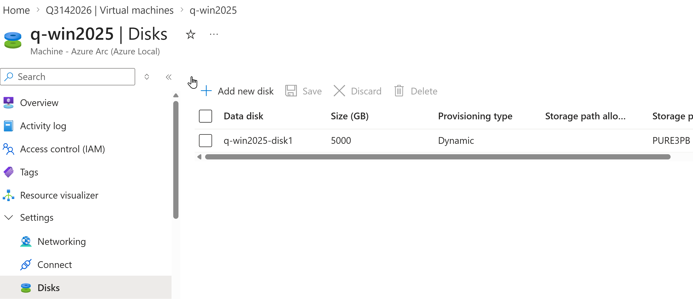
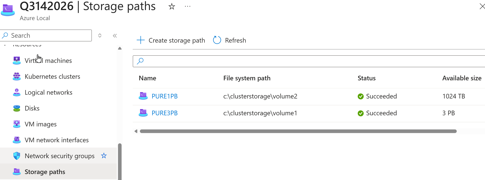

+++
date = '2026-04-04T13:15:39-07:00'
draft = false
title = 'Azure Local and Everpure'
baseURL = 'https://purepowershell.com/'
tags = ['Azure Local','FlashArray', 'Hyper-V']
+++

I have been working on Azure Local (formerly Azure Stack HCI) for almost five years, and we are now less than 1 month from GA for Fibre Channel external storage. For the initial support in April 2026, there is no OS code change, so you should deploy Azure Local with a Windows Server 2025 certified Fibre Channel card that your server OEM supports in that server model. Connecting to the Everpure FlashArray is done after the deployment from the Azure Portal.

A simplistic summary of what has to happen after Azure Local is deployed:
* Install a 16Gb or faster FC card. The number of cards and ports on each card will be determined by the failure cases you are solving for as well as the bandwidth required in the event of those failures.
* Install the FC Driver/Firmware
* Physically connect Azure Local to Everpure FlashArray
* Configure FC zoning
* Create a Host and configure the FC WWN Host Port on the FlashArray
* Create a Host Group and add all of the Azure Local Hosts to it on the FlashArray
* Create a Volume on the FlashArray and add it to the Host Group
* Format the new Volume on one node in the cluster
* Add the volume to the cluster
* Configure the cluster disk as a cluster shared volume (CSV)
* In the Azure Portal, add the Storage Path to the Everpure CSV

In this IPMI connected KVM screen, you can see the virtual disks associated with my Windows Server 2025 VM. Hyper-V is using the VHD file, whereas hydration keeps a tracking VHDX file that is registered in the Azure Resource Group.

===\
In Failover Cluster Manager you can see the Virtual Machines and other Azure Local resources under Roles.

===\
If we navigate to disks, you can see the 2 disk per node S2D, HCI CSV as well as the 2 Everpure volumes.

===\
Windows Admin Center can also show you detailed Virtual Machine information.

===\
Navigating to the FlashArray GUI, you can see the Host and Host Groups where the 2 Volumes are connected to the Host Group. This makes is simpler to add and subtract nodes in a cluster since the mapping is to the Host Group and not the Host.

===\
This image shows the 3PB Volume that is configured as a CSV and attached to the Azure Local cluster. It is registered as a Storage Path.

===\
In the Azure Portal, the VMs disks are stored on the Everpure Storage Path.

===\
In the Azure Portal, the 2 Everpure volumes are both registered under Storage Path. In this deployment, since infrastructure-only was chosen, there wasn't enough local storage to bother utilizing it for anything other than infrastructure, such as the Azure Arc Resource Bridge VM, so it was not registered as a Storage Path.
