+++
date = '2025-02-28T16:03:01-08:00'
draft = false
title = 'Hyper-V CSV Trim'
tags = ['FlashArray', 'Hyper-V', 'CSV']
+++
TLDR: Newer versions of Windows will free blocks on a Cluster Shared Volume.

I work on a lot of Failover Clusters and about once a year it would come up that a customer had a situation with disk space. Usually it was older, out of support, versions of Windows and the scenario was that recently a bunch of VMs were moved from 1 Cluster Shared Volume (CSV) to another. The CSV volume on the FlashArray was not releasing the blocks. That left a customer with a handful of choices:
* Run [sdelete](https://learn.microsoft.com/en-us/sysinternals/downloads/sdelete "sdelete") from Microsoft's SysInternals. This will take a long time as all free space in the CSV is zeroed, thereby freeing up the space on the FlashArray.
* Move the remaining items from the CSV to a new CSV and then delete the original. This is not really an option if the available capacity is dangerously low. If the capacity is not low and pods are not involved, offloaded data transfer (ODX) will perform the copy in seconds to minutes because it offloads the copy to the storage and the FlashArray will just update metadata.

I have been doing a ton of work with Windows Server 2025 and Windows Admin Center (next blog topic!), so I used that test bed. To really show trapped blocks I bitlocker encrypted two different static VHDX files, one containing a couple hundred gigabytes of ISO files, and one containing a couple hundred gigabytes of randomly written data with DiskSpd.

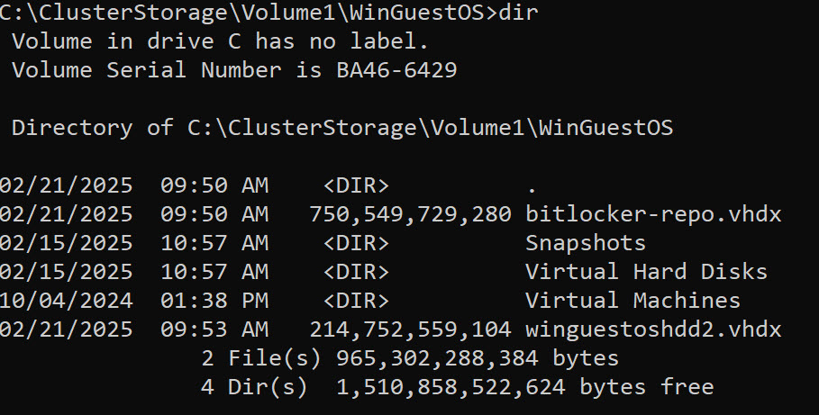
In figure 1 above you can see 2 VHDX files in a particular VMs subfolder on a CSV that is mounted as 'C:\clusterstorage\volume1'. Within the VM the 'E' drive is fixed ~200GB virtual disk containing random diskspd data, and the 'F' drive is a fixed ~700GB virtual disk containing a repository of ISO files.

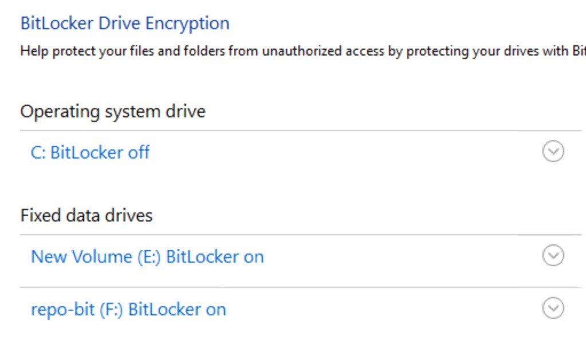
In figure 2 above, inside the VM, both the 'E' and 'F' drives are bitlocker encrypted.

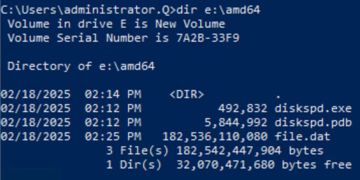
In figure 3 above, the image shows the contents of the encrypted 'E' drive.

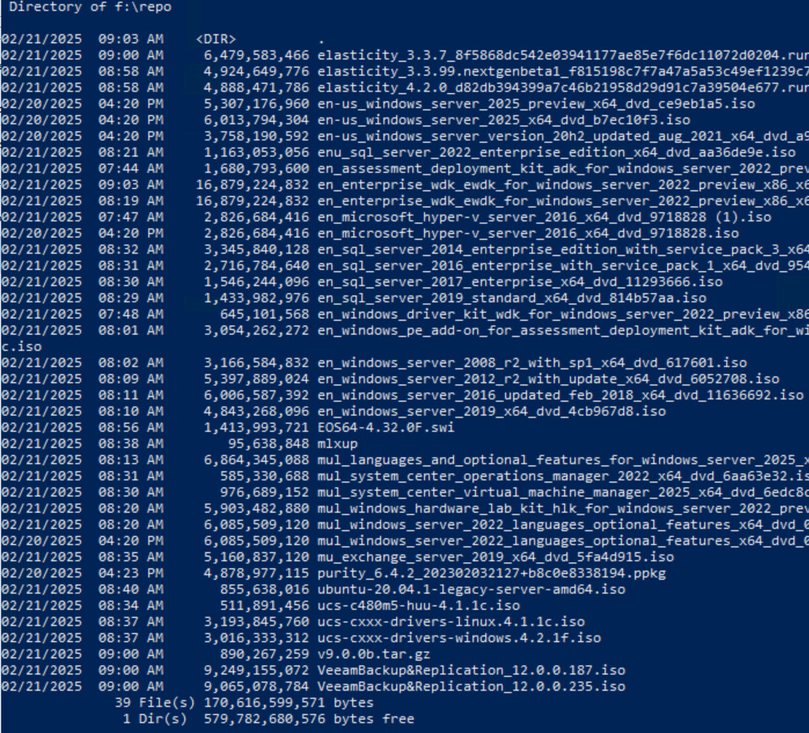
In figure 4 above, the image shows the contents of the encrypted 'F' drive.

The steady-state before the move was that these encrypted virtual hard disk files existed on the CSV mounted at c:\clusterstorage\volume3. Combined they were fixed virtual disks and they consumed ~900GB of space in the CSV.

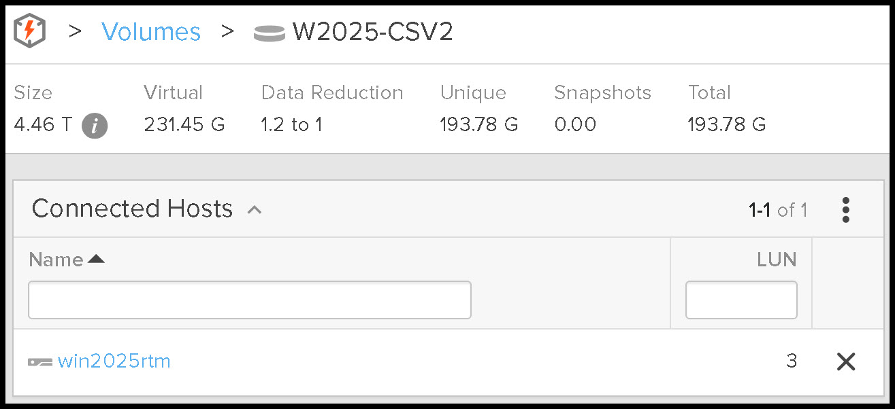
In figure 5 above, the image shows the storage consumption of the CSV (C:\clusterstorage\volume3) before performing a storage live migration. While the virtual disks are encrypted with ~350GB of unique data on fixed virtual disks consuming ~900GB on the CSV, the FlashArray is still able to reduce the data to approximately 231GB. Since the data reduction on a FlashArray is global, and I don't have any brand new unused FlashArray's to play with, there happened to be ~38GB of data on the volume, that was a duplicate of data stored elsewhere on the FlashArray. This is why it states there was 193GB of unique data.

In figure 6 above, the image shows the storage consumption of the nearly empty CSV which just contains all of the VM files except the 2 encrypted non-boot virtual disks. Since the boot/system disk is very similar to other VMs on the FlashArray it is showing ~12GB of consumption, but only .75GB of unique data. Operating System images even with differing levels of updates tend to have pretty high data reduction rates.

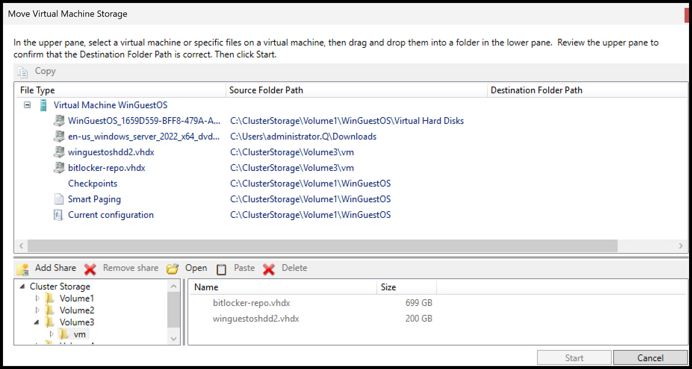
In figure 7 above, the image shows the current location for all files on the virtual machine. Both of the 2 encrypted virtual disks are located on C:\clusterstorage\volume3\vm.

In figure 8 above, the Move Virtual Machine Storage wizard is open. To kick off the move, navigate to the CSV target, in this case Volume1 and drag the virtual disks from the top File Type pane to the bottom Cluster Storage pane. Not only do the 2 virtual disks show in the bottom pane in the new path, they also show where they are moving in the File type pane under Destination Folder Path. In this case the 2 virtual disks are moving from Volume3 to Volume1.

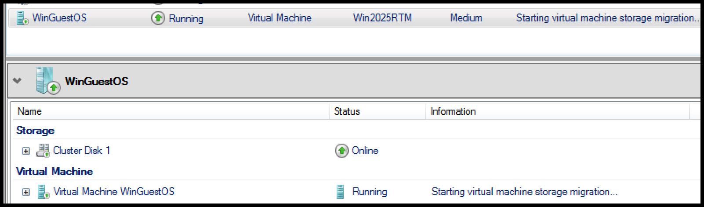
In figure 9 above, the selected storage virtual machine items are starting to move, which is indicated in the information column on the virtual machine. The move took about 4 minutes because the FlashArray honors offloaded data transfer (ODX) requests from Windows. If the source or target in part of a Purity Pod, or if the source or the target is formatted with ReFS, ODX is not in play, and in this storage sized example, the movement takes approximately 35 minutes and eats up both storage throughput as well as additional compute. Since both of these CSVs are not in a Purity Pod, and the disks are formatted with NTFS, ODX is in play and the transfer is fast.

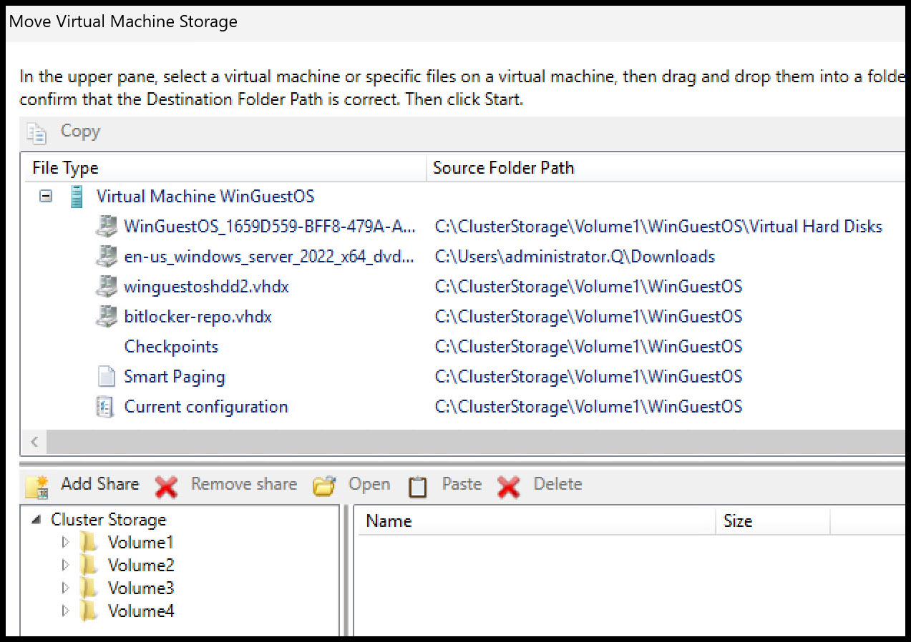
In figure 10 above, the 2 disks have completed the move, and show as being on Volume1.

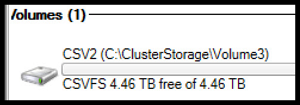
In figure 11 above, volume3 shows logically in the Hyper-V Server that the move is complete, and that the filesystem has freed all of the blocks in Windows.

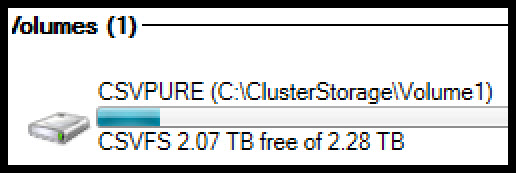
In figure 12 above, volume1 shows logically in the Hyper-V Server that after moving 900GB of VHDX files it is only consuming about 200GB of space in the CSV.

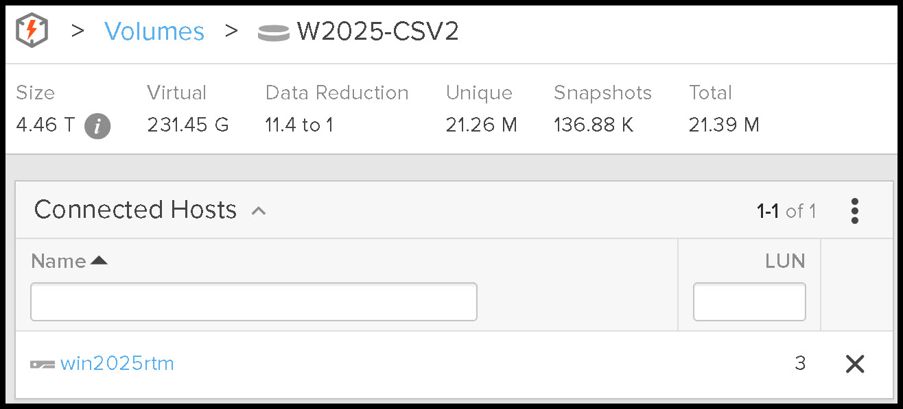
In figure 13 above, volume3 on the FlashArray shows that all of the blocks were freed. Contrast figure 13 above with figure 5. Total data consumption for the volume is 21MB, no longer the 193GB that was consumed before the move.

In older versions of Windows these blocks would not be freed on the FlashArray and sdelete would have been required. In a future post I'll demonstrate an older version of Windows where the blocks are not freed requiring sdelete.