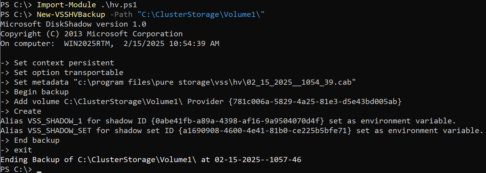
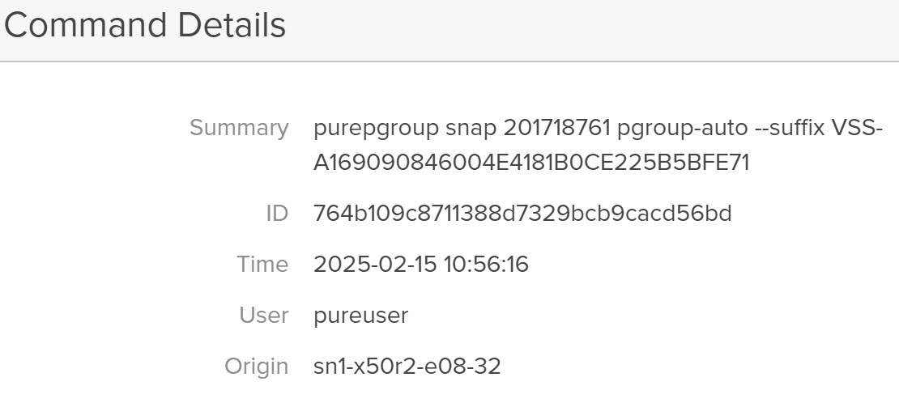

+++
date = '2025-02-15T11:05:00-08:00'
draft = false
title = 'Hyper-V VSS'
+++
There are many different strategies for backing up a production Hyper-V environment. In this blog post I will focus on a hardware Volume Shadow-Copy Service (VSS) snapshot of a Cluster Shared Volume (CSV). VSS creates an application consistent snapshot where all of the VMs are in a good state so that if you restore the volume, or clone the snapshot and mount it outside of the Failover Cluster, the VMs will boot without issue. Keep in mind that this is a hypervisor driven snapshot, which is different from an application snapshot inside of a virtual machine. An Exchange Server or SQL Server database will not show that a 'backup' has been taken. Some third party backup applications (VSS Requestors), can handle this, but that is because the backup application is performing additional work inside of the VMs.

A pre-requisite for my example Hyper-V VSS script is to install and configure the Pure Storage VSS Hardware Provider. The provider can be found at: https://github.com/PureStorage-Connect/VSS-Provider

    Run the pureproviderconfig.exe in 'c:\program files\pure storage\vss\provider' to add the FlashArray.

    For example:
    pureproviderconfig add --url https://ipaddress.of.flasharray --user USERNAME FlashArrayFriendlyName

Once this has been done check that the provider was able to login to the FlashArray with:

    pureproviderconfig list

If it has an issue, it probably means the FlashArray has been upgraded to at least Purity Operating Environment 6.5.0 or later, and the Operating System is older than Windows Server 2025. The easiest fix is to enable TLS 1.3 and ensure the cyphers are enabled.

This script is focusing on a VSS backup of a CSV. If there is demand (open requests in GIT), I will add logging, error checking, and an event lookup that backup succeeded. If there is demand for both mounting (expose in VSS) or restore, I can add those functions as well but I have found in production these are seldom used.

With the script, open as administrator a PowerShell session and use Import-Module on the filename. Next initiate a VSS backup by simply passing the path to the CSV as the path parameter.

    For Example: New-VSSHVBackup -Path "C:\clusterstorage\volume1"

Most VSS backups occur in 5-10 seconds with many different VSS writers involved. The CSV writer is particularly slow, and that lag increases linearly as additional nodes are added to a cluster. With a 1-2 node Failover Cluster expect a 60-150 second lag before a snapshot command is sent to external storage, and another 30-60 seconds before the script is complete.

In the Pure Storage FlashArray GUI, the audit log shows that a VSS snapshot was taken, because the VSS Provider will append a suffix which starts with 'VSS-'

In the Pure Storage FlashArray GUI, the Volume also shows the snapshot was created. Since this Volume was part of a Protection Group, a Protection Group snapshot was taken. A Protection Group has multiple purposes. A Protect Group snapshot ensures that all Volumes that are in the Protection Group are consistent with each other. Policies can be assigned to a Protection Group that involve automated snapshots at particular intervals, retention settings that indicate the number of snapshots and length of retention at the source and target location, and the target or targets where the snapshots are to be replicated. This can be another physical or virtual (Cloud Block Store) FlashArray, or a FlashBlade or cloud volume.  

