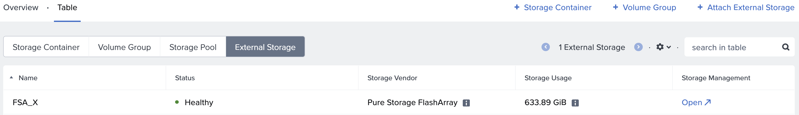
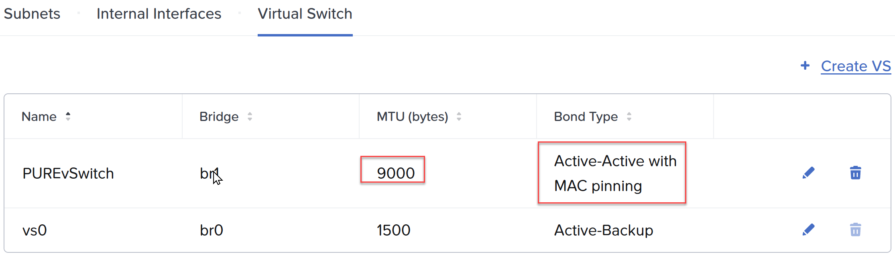
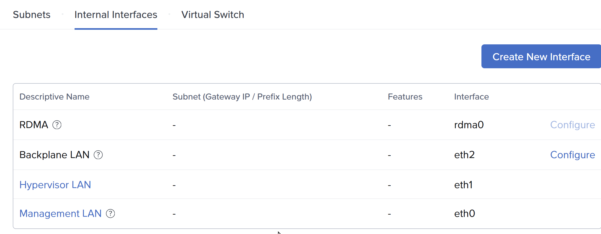
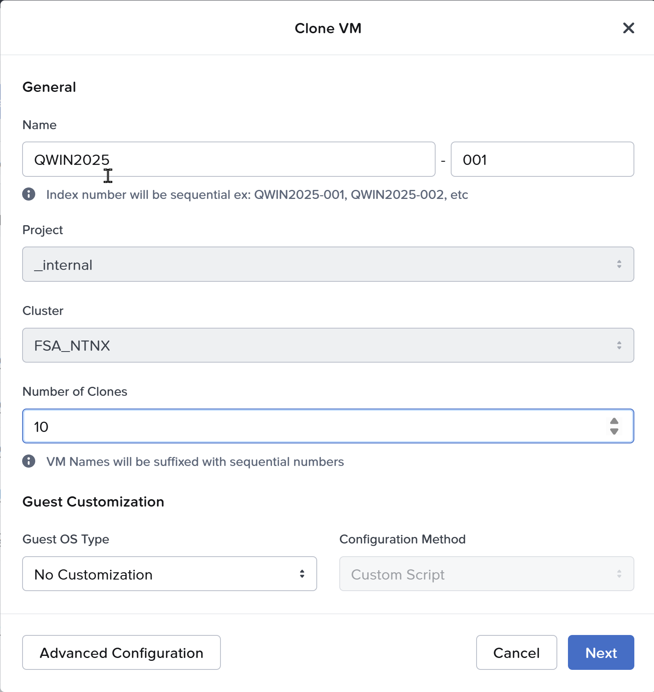
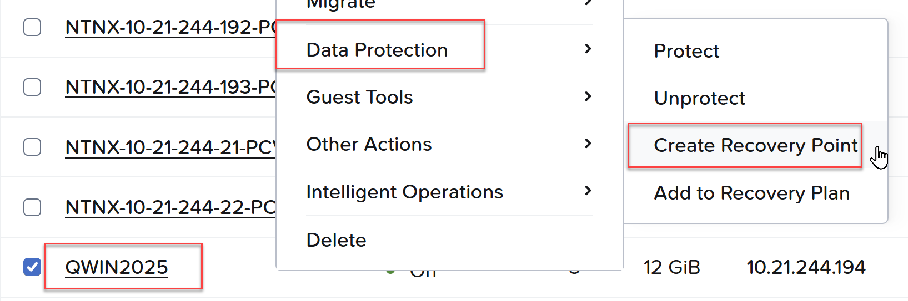

+++
date = '2026-04-14T10:47:06-07:00'
draft = false
title = 'Nutanix and Everpure'
tags = ['FlashArray', 'Nutanix']

+++

I have been working with Nutanix for a couple of years, and the integrations with Everpure went GA in December of 2025.  The public excitement has been building, first at Nutanix.Next in May 2025 when it was first announced, and then last week at .Next in Chicago. We had a real opportunity to take a look at what works well on other hypervisor platforms and really design the integration from a blank piece of paper.

For example:

* Should we have 1 big datastore or a 1:1 mapping of VM disk to Storage Array disk? (We chose 1:1)
* Should we do FC or Ethernet? (We chose Ethernet, using NVMeoF/TCP)
* Should we connect to the storage from AHV or the Controller VM? (We chose CVM)

We decided on a model that was similar to virtual disks, but gave you a real disk, similar to an RDM or pass-through disk. The experience is administratively the same, you simply add a vDisk or Volume Group to the VM, and a Volume is provisioned on the Everpure FlashArray. This disk granularity helps an administrator to focus on the VMs, and not have to worry about what disk(s) the VM is on. If you want to clone the VM, no problem. Take a consistent snapshot across all the disks on the VM, easy. How about replicate at the VM level, built-in.

Deployment
On the FlashArray this can be as simple as creating a Realm and a Pod in that Realm, and ensuring the NVME-TCP service is enabled on some of the Ethernet ports.  You should minimize the attack surface by creating a management access policy and assigning a service account to that policy. You can also set a quota on the Pod to ensure a development cluster couldn't consume all the capacity on a FlashArray, for example.

In Prism Element (CVM), you can click on external storage enter the FlashArray credentials, select the realm, and select the Pod. At this point you are done and everything will be automatically configured. Most customers want to dedicate uplinks for external storage traffic, so a prerequisite would be to configure that which involves creating a dedicated vSwitch and Interface.

Above is where you would click "Attach External Storage" and add it. This has been done, and you can see the FSA_X FlashArray.

Above I have created a new vSwitch and selected my fasted, 2x100Gb NICs. For NVMeoF/TCP we recommend ensuring Jumbo Frames is configured on the entire storage path. Be sure to select a teaming scheme: Active/Active with MAC pinning, or if you LACP at the switch layer, simply Active/Active.

Above, under interfaces, I will create an interface, select the Pure vSwitch and select the "External Storage" feature.

Fibre Channel or Ethernet?
At the time of this writing both 128G FC and 400G Ethernet is available, but hard to find, and not currently supported in a FlashArray. Our recent XLR5, or 5th generation platform, supports but 64G FC and 200G Ethernet. This approximate tripling of bandwidth has been sustained for a while, and expected for at least the next several years. I estimate 256G FC will be generally available around the time 800G Ethernet, in 3-4 years.  The important distinction here is that iSCSI is older, it is still SCSI, and with more throughput can sometimes leave IO on the table if you don't double, or in some cases triple the number of sessions on the same physical storage path. With NVMe, the traditional method involved RoCE or RoCEv2, which is RDMA (Remote Direct Memory Access) over Converged Ethernet. The problem with RoCE is every switch in the path has to support it and I have been involved so often where it was not configured correctly. With NVMeoF/TCP, if you can ping it you are good. It is using the standard TCP/IP as the fabric.  Be sure to utilize Jumbo Frames. With iSCSI it is a rounding error, with NVMeoF/TCP it is worth the effort!

AHV or CVM?
Initially it was thought the cost of another network hop (10-30us) was not worth it. In practice had AHV been the connection to the FlashArray, we could have achieved, a very slight latency win.  However, we would have broken every single thing above that in the stack. Imagine having to get a particular 3rd party backup application to plugin and work with Everpure! With the CVM being the API endpoint, everything works! 
For instance:

* You want to replicate between two Everpure backed Nutanix Compute Clusters? No problem
* You want to replicate where one of the clusters is Nutanix HCI? No problem
* You want to backup your Nutanix Compute Cluster with Everpure? It just works
* You backed up a VM on an HCI cluster and want to restore it to Everpure? Yep
* You want to use Nutanix replication to replicate from an HCI cluster to a Compute Cluster? You can!

If you remember one statement from this post, it is that everything on Everpure is transparently taken care of on the FlashArray through Prism Central. 

Have you ever cloned a VM on AHV?

Above, you simply right click a VM and select clone.

Have you ever taken a snapshot of a VM on AHV?

Above, right click a VM, Data Protection, Create a Recovery Point.  All the vDisks mapped to the VM have a consistent snapshot taken on the Everpure Volumes.

Since GA late last year, we added support for FlashArray//C and Nutanix Kubernetes Platform (NKP). Just a few weeks ago AOS 7.5.1 went GA adding live migration between Nutanix Compute Clusters, and 0 RPO, synchronous replication between Compute Clusters!

In the next quarter look for 7.6, the payload will be impressive.  
'til then